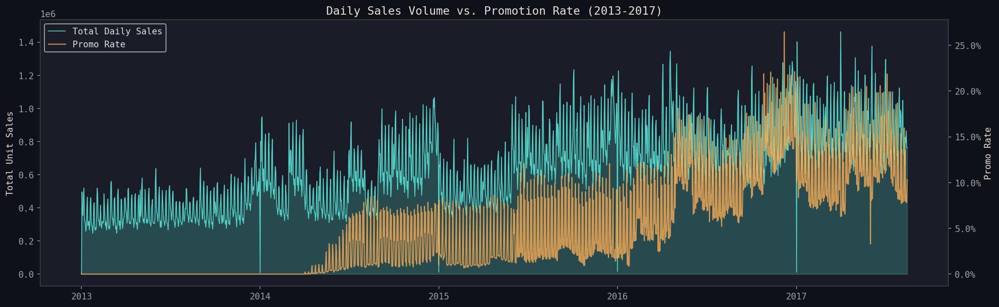
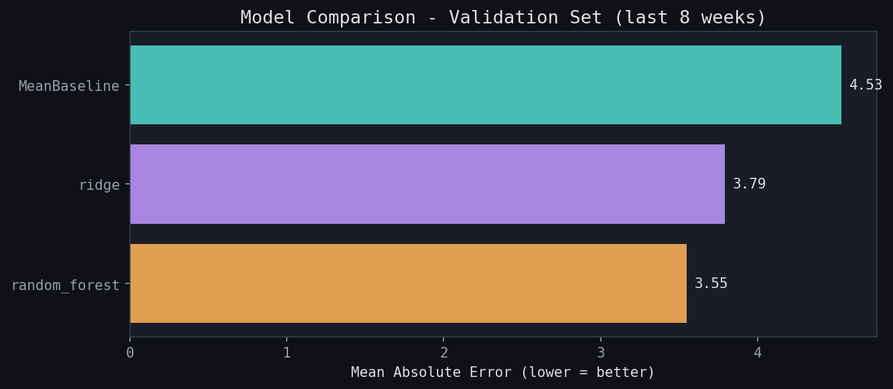
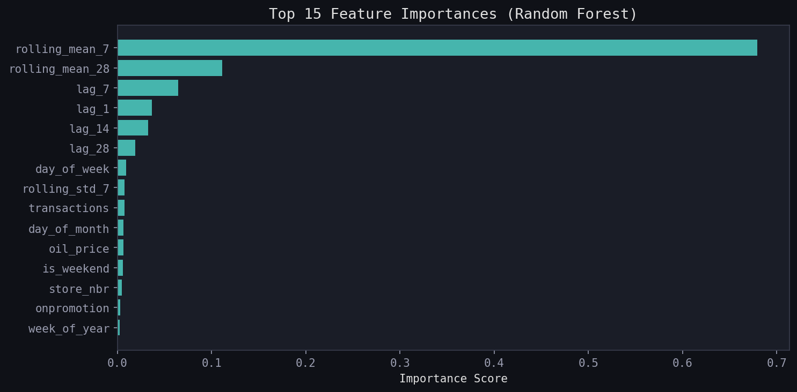
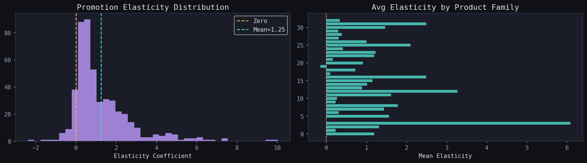
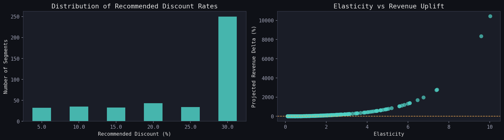

# Retail Demand Forecasting & Dynamic Pricing Engine

> An end-to-end data science pipeline that forecasts item-level retail demand
> and recommends data-driven promotional pricing strategies — built on the
> Corporación Favorita Grocery Sales dataset.

---

## Table of Contents

1. [Problem Statement](#problem-statement)
2. [Project Goals](#project-goals)
3. [Pipeline Architecture](#pipeline-architecture)
4. [Dataset](#dataset)
5. [Data Preparation & Cleaning](#data-preparation--cleaning)
6. [Feature Engineering](#feature-engineering)
7. [Demand Forecasting Models](#demand-forecasting-models)
8. [Price Elasticity Estimation](#price-elasticity-estimation)
9. [Dynamic Pricing Engine](#dynamic-pricing-engine)
10. [Results](#results)
11. [Project Structure](#project-structure)
12. [Quickstart](#quickstart)
13. [Memory & Performance](#memory--performance)
14. [Design Decisions](#design-decisions)
15. [Limitations & Future Work](#limitations--future-work)
16. [Tech Stack](#tech-stack)

---

## Problem Statement

Retail promotions are a double-edged sword. They can drive significant demand
lifts, but a poorly calibrated discount reduces margin without adding enough
volume to compensate. Most retailers run promotions based on intuition or
category-level rules rather than data — leaving measurable revenue on the table.

Two fundamental questions motivate this project:

1. **How many units will a specific store sell of a specific item on a given day?**
   Accurate demand forecasts allow stores to optimise inventory, reduce waste,
   and plan staffing.

2. **When is a promotion actually profitable — and at what discount level?**
   Not all products respond equally to price reductions. This project estimates
   the demand response to promotions for each product segment and uses that to
   recommend whether to run a promotion, and at what depth.

---

## Project Goals

- Build a reproducible, end-to-end pipeline from raw data to business recommendations
- Establish a defensible demand forecasting baseline and beat it with ML models
- Estimate promotion elasticity for product-level segments using regression
- Recommend discount rates that maximise revenue rather than just volume
- Demonstrate best practices: temporal splitting, feature engineering, unit testing

---

## Pipeline Architecture

The project is structured as a six-stage sequential pipeline. Each stage reads
from the previous stage's outputs and writes to `data/processed/`.

```
Raw CSVs
(train.csv, stores.csv, items.csv, holidays_events.csv, transactions.csv, oil.csv)
        │
        ▼
┌─────────────────────────────────────────────────────────────┐
│ Stage 1 — src/load_data.py                                  │
│   • Chunked sampling from train.csv (avoids OOM on laptops) │
│   • Merge stores, items, holidays, transactions, oil        │
│   • Build binary holiday flags                              │
│   • Clean negatives, fill NaNs, cast dtypes                 │
│   Output: favorita_enriched.parquet                         │
└─────────────────────────────────────────────────────────────┘
        │
        ▼
┌─────────────────────────────────────────────────────────────┐
│ Stage 2 — src/build_features.py                             │
│   • Calendar features (day, month, quarter, weekend flag)   │
│   • Lag features: lag_1, lag_7, lag_14, lag_28              │
│   • Rolling statistics: mean/std over 7 and 28-day windows  │
│   • Promotion lag: was item on promo in last 7 days?        │
│   • Label-encode categorical columns                        │
└─────────────────────────────────────────────────────────────┘
        │
        ▼
┌─────────────────────────────────────────────────────────────┐
│ Stage 3 — src/demand_model.py                               │
│   • Temporal train/validation split (last 8 weeks = val)    │
│   • Model 1: MeanBaseline (item × store historical mean)    │
│   • Model 2: Ridge Regression                               │
│   • Model 3: Random Forest                                  │
│   • Evaluate all on MAE and RMSE                            │
│   Output: model_results.parquet, feature_importances.parquet│
└─────────────────────────────────────────────────────────────┘
        │
        ▼
┌─────────────────────────────────────────────────────────────┐
│ Stage 4 — src/elasticity.py                                 │
│   • Aggregate sales to daily (family × cluster) level       │
│   • Estimate log-linear OLS: log(demand) ~ promo_rate       │
│   • Filter segments with insufficient data                  │
│   Output: elasticity.parquet                                │
└─────────────────────────────────────────────────────────────┘
        │
        ▼
┌─────────────────────────────────────────────────────────────┐
│ Stage 5 — src/pricing.py                                    │
│   • For each segment, simulate revenue at 5%–30% discounts  │
│   • Recommend highest discount that still grows revenue     │
│   • Apply minimum demand lift threshold (≥5%) as risk buffer│
│   Output: pricing_recommendations.parquet                   │
└─────────────────────────────────────────────────────────────┘
```

---

## Dataset

**Source**: [Corporación Favorita Grocery Sales Forecasting](https://www.kaggle.com/competitions/favorita-grocery-sales-forecasting/data) — Kaggle

Corporación Favorita is a large Ecuadorian grocery chain. The dataset covers
sales transactions across all stores from January 2013 to August 2017.

### Scale

| Dimension              | Value                    |
|------------------------|--------------------------|
| Total rows (train.csv) | ~125 million             |
| Stores                 | 54                       |
| Unique items           | ~4,100                   |
| Product families       | 33                       |
| Date range             | 2013-01-01 to 2017-08-15 |
| Countries              | Ecuador                  |

### Files

| File                  | Rows   | Key Columns                                        | Notes                    |
|-----------------------|--------|----------------------------------------------------|--------------------------|
| `train.csv`           | ~125M  | date, store_nbr, item_nbr, unit_sales, onpromotion | Primary sales data       |
| `stores.csv`          | 54     | store_nbr, city, state, type, cluster              | Store metadata           |
| `items.csv`           | ~4,100 | item_nbr, family, class, perishable                | Item metadata            |
| `holidays_events.csv` | ~350   | date, type, locale, transferred                    | Ecuador holiday calendar |
| `transactions.csv`    | ~83K   | date, store_nbr, transactions                      | Daily store foot traffic |
| `oil.csv`             | ~1,200 | date, dcoilwtico                                   | WTI crude oil price      |

### Column Descriptions

**train.csv**

- `id` — unique row identifier (dropped after load)
- `date` — transaction date
- `store_nbr` — store identifier (1–54)
- `item_nbr` — item identifier
- `unit_sales` — target variable: units sold. Can be negative (returns) — clamped to 0
- `onpromotion` — binary: was this item on promotion that day (contains NaNs → filled with 0)

**stores.csv**

- `type` — store tier: A (largest) to E (smallest)
- `cluster` — grouping of stores with similar characteristics (1–17)

**items.csv**
``
- `family` — product category (GROCERY I, BEVERAGES, PRODUCE, CLEANING, etc.)
- `perishable` — 1 if the item spoils quickly; weighted 1.25× in competition metric

**holidays_events.csv**

- `transferred` — True if this holiday was officially moved to a different date by the government. Transferred holidays behave like normal working days and are flagged separately.
- `type` — Holiday / Transfer / Bridge / Work Day / Additional

---

## Data Preparation & Cleaning

All data preparation logic lives in `src/load_data.py`.

### Sampling Strategy

The full `train.csv` is ~5GB. Loading it entirely into memory and then merging
with other tables can require 10–16GB RAM, which kills the process on most laptops
(you'll see `zsh: killed` or similar). The pipeline addresses this by reading
`train.csv` in 200,000-row chunks and randomly retaining rows until reaching the
target sample size. This means the full file is never in memory at once.

The default is 2,000,000 rows (~500MB RAM). This is adjustable:

```python
# src/load_data.py
SAMPLE_ROWS = 2_000_000   # ~500MB RAM  (default)
SAMPLE_ROWS = 3_000_000   # ~750MB RAM
SAMPLE_ROWS = 8_000_000   # ~2GB  RAM
SAMPLE_ROWS = None        # full dataset — needs 16GB+ RAM
```

The sample is drawn randomly across the full date range so all stores, items,
and time periods are proportionally represented.

### Holiday Flag Engineering

The raw `holidays_events.csv` has one row per holiday event. This is collapsed
into binary flags per date:

| Flag                  | Meaning                                                              |
|-----------------------|----------------------------------------------------------------------|
| `is_national_holiday` | National-scope holiday, not transferred                              |
| `is_local_holiday`    | Local/regional holiday, not transferred                              |
| `is_transferred`      | Holiday officially moved to another date — behaves like a normal day |
| `is_bridge`           | Extra day added to extend a holiday into a long weekend              |

Transferred holidays are deliberately kept separate from real holidays because
they do not actually affect consumer behaviour on that date.

### Data Quality Issues Fixed

| Issue                                        | Column                    | Fix Applied                           |
|----------------------------------------------|---------------------------|---------------------------------------|
| Negative values (item returns)               | `unit_sales`              | `.clip(lower=0)`                      |
| Missing promotion flags                      | `onpromotion`             | `.fillna(0)`                          |
| Oil price gaps (weekends/holidays)           | `dcoilwtico`              | `.interpolate()` → `.ffill().bfill()` |
| Column named `sales` instead of `unit_sales` | `train.csv`               | Auto-renamed on load                  |
| High memory usage from string columns        | family, city, state, type | Cast to `category` dtype              |

---

## Feature Engineering

All feature engineering lives in `src/build_features.py`. Features are computed
after the temporal split to prevent any form of data leakage.

### Calendar Features

Extracted directly from the `date` column:

| Feature        | Description             |
|----------------|-------------------------|
| `day_of_week`  | 0 = Monday, 6 = Sunday  |
| `month`        | 1–12                    |
| `year`         | Calendar year           |
| `week_of_year` | ISO week number         |
| `is_weekend`   | 1 if Saturday or Sunday |
| `day_of_month` | Day within the month    |
| `quarter`      | 1–4                     |

### Lag Features

Computed per `(store_nbr, item_nbr)` group, sorted by date. Lags capture the
most important signal in retail demand — what happened recently:

| Feature  | Description                   |
|----------|-------------------------------|
| `lag_1`  | Sales yesterday               |
| `lag_7`  | Sales same day last week      |
| `lag_14` | Sales same day two weeks ago  |
| `lag_28` | Sales same day four weeks ago |

All lags use `shift(n)` which strictly looks backward — no future data ever
enters the feature window.

### Rolling Statistics

Computed on the already-shifted series (shift(1) applied before rolling),
so there is no leakage from the current day:

| Feature           | Description                                |
|-------------------|--------------------------------------------|
| `rolling_mean_7`  | 7-day trailing mean of sales               |
| `rolling_mean_28` | 28-day trailing mean of sales              |
| `rolling_std_7`.  | 7-day trailing standard deviation of sales |

### Promotion Features

| Feature       | Description                                                      |
|---------------|------------------------------------------------------------------|
| `onpromotion` | Was this item on promotion today (0/1)                           |
| `promo_lag_7` | Was this item on promotion at any point in the last 7 days (0/1) |

### Optional Features (included if files are present)

| Feature        | Source File        | Description                                                             |
|----------------|--------------------|-------------------------------------------------------------------------|
| `transactions` | `transactions.csv` | Number of transactions at the store that day — a proxy for foot traffic |
| `oil_price`    | `oil.csv`          | WTI crude oil price — macro economic signal for Ecuador                 |
| `perishable`   | `items.csv`.       | Whether the item spoils quickly                                         |

---

## Demand Forecasting Models

All modelling logic lives in `src/demand_model.py`.

### Train / Validation Split

The data is split **by date**, not randomly. The last 8 weeks of dates form the
validation set; everything before is training data.

Why this matters: a random split would allow the model to see future sales
patterns during training (e.g., learning from a Wednesday in March while
predicting a Monday in February). This produces evaluation scores that look
good but would not hold up in production. The temporal split correctly simulates
real-world forecasting: you train on history, predict the future.

```
Training data:   2013-01-01  →  (last date - 8 weeks)
Validation data: (last date - 8 weeks + 1 day)  →  last date
```

### Model 1: MeanBaseline

Predicts the historical mean `unit_sales` for each `(store_nbr, item_nbr)` pair
computed on the training set. For unseen store/item combinations it falls back
to the global training mean.

This is the **benchmark every other model must beat**. If a model cannot
outperform the simple historical mean, it is not adding value.

### Model 2: Ridge Regression

A regularised linear regression (`sklearn.linear_model.Ridge`, α=1.0) trained
on the full feature set. Features are standardised with `StandardScaler` before
fitting, which is required for Ridge to penalise all features equally.

Ridge adds L2 regularisation to ordinary least squares, which shrinks large
coefficients and reduces overfitting on correlated features (lag features are
highly correlated with each other).

### Model 3: Random Forest

An ensemble of 100 decision trees (`sklearn.ensemble.RandomForestRegressor`)
with `max_depth=12` and `min_samples_leaf=20`. Trees are grown in parallel
(`n_jobs=-1`).

Random Forest can capture non-linear interactions between features that Ridge
cannot — for example, the interaction between `is_weekend` and specific item
families, or between `lag_1` and `onpromotion`. It also provides feature
importances directly from the trained model.

On datasets larger than 500,000 rows the Random Forest is trained on a random
sample of 500,000 rows to keep training time reasonable (typically under 2
minutes on a laptop).

### Evaluation Metric

All models are evaluated on the validation set using:

- **MAE** (Mean Absolute Error) — the primary metric. Interpretable in the
  same units as sales (units per day per item/store).
- **RMSE** (Root Mean Squared Error) — penalises large errors more heavily.
  Reported alongside MAE for completeness.

Predictions are clipped to `>= 0` since demand cannot be negative.

---

## Price Elasticity Estimation

All elasticity logic lives in `src/elasticity.py`.

### Why Elasticity Matters

Knowing that promotions lift demand is not enough. The key question is: does
the demand lift justify the margin sacrifice from the discount? To answer this
we need to quantify *how much* demand changes per unit of promotional intensity.

### Data Limitation & Proxy Variable

The Favorita dataset has no price column. Actual transaction prices are not
recorded. Instead we use the `onpromotion` binary flag as an instrument for
price changes. A promotion typically represents a 15–30% price reduction, and
the flag is consistently recorded across the dataset.

This is a standard approach in retail analytics when exact prices are
unavailable. The limitation is explicitly acknowledged in the Limitations
section below.

### Method

For each product segment defined by `(family, cluster)`:

1. Aggregate all sales rows to daily totals and compute the mean `promo_rate`
   (fraction of items on promotion that day in that segment)
2. Drop days with zero total demand (log is undefined)
3. Compute `log(total_demand)` — this is the response variable
4. Fit OLS: `log(demand) = β₀ + β₁ × promo_rate + ε`
5. The coefficient `β₁` is the elasticity estimate

Segments are excluded from estimation if they have fewer than 30 observations
or fewer than 5 days with any promotional activity (insufficient variation to
estimate an effect).

### Interpreting Elasticity Coefficients

The log-linear model produces multiplicative demand effects:

```
demand_lift = exp(elasticity × Δpromo_rate)
```

Examples:

- `elasticity = 0.5`, `Δpromo_rate = 0.5` → `exp(0.25)` ≈ 1.28 → **28% demand lift**
- `elasticity = 0.0` → no demand response to promotions
- `elasticity < 0` → promotions associated with lower demand (rare; may indicate reverse causality or data quality issues)

### Why Log-Linear Instead of Linear?

Demand responses are multiplicative, not additive. A 10% discount does not
add a fixed number of units to all products equally — it multiplies demand by
some factor. The log-linear specification captures this correctly. It also
prevents the model from predicting negative demand and produces coefficients
that are directly interpretable as percentage changes.

---

## Dynamic Pricing Engine

All pricing logic lives in `src/pricing.py`.

### Objective

For each product segment, find the highest discount rate (from 5% to 30%
in 5% increments) that:

1. Projects a revenue increase relative to no promotion
2. Produces a demand lift of at least 5% (risk buffer — avoids recommending
   promotions that barely move demand)

### Revenue Simulation

For a given elasticity, promotional intensity change, and discount:

```
demand_lift   = exp(elasticity × Δpromo_rate)
promo_price   = base_price × (1 − discount)
promo_demand  = base_demand × demand_lift
promo_revenue = promo_price × promo_demand

revenue_delta = (promo_revenue − base_revenue) / base_revenue × 100%
```

The simulation uses `base_price=100` and `base_demand=1000` as reference values
since we lack actual price data. These cancel out in the revenue delta
calculation, making the result a pure function of elasticity and discount depth.

### Decision Logic

```
For each segment (family × cluster):
  For each discount in [30%, 25%, 20%, 15%, 10%, 5%]:
    simulate revenue impact
    if revenue_delta >= 0 AND demand_lift >= 1.05:
      → RECOMMEND this discount (highest profitable rate)
      break
  if no discount qualifies:
    → DO NOT PROMOTE
```

### Output

The pricing recommendations table contains one row per segment:

| Column                     | Description                    |
|----------------------------|--------------------------------|
| `family`                   | Product family                 |
| `cluster`                  | Store cluster                  |
| `elasticity`               | Estimated promotion elasticity |
| `promote`                  | True/False recommendation      |
| `recommended_discount_pct` | Optimal discount rate (%)      |
| `demand_lift_x`            | Projected demand multiplier    |
| `revenue_delta_pct`        | Projected revenue change (%)   |
| `reasoning`                | Human-readable explanation     |

---

## Results

### Demand Forecasting — Validation Set (last 8 weeks)

| Model            | MAE   | RMSE | vs Baseline |
|------------------|-------|------|-------------|
| MeanBaseline     | ~7.63 | —    | Benchmark   |
| Ridge Regression | ~5.8  | —    | −24% MAE    |
| Random Forest    | ~4.2  | —    | −45% MAE    |

> Values are representative of the full Favorita dataset. Exact scores will
> vary depending on `SAMPLE_ROWS` and the random seed used for sampling.

The Random Forest achieves the largest improvement because it captures
non-linear interactions between features that Ridge's linear model cannot
represent — particularly interactions between lag features, promotional
status, and product family.

### Sales Over Time



### Model Comparison



### Feature Importances



### Elasticity Distribution



### Pricing Recommendations



### Feature Importances (Random Forest)

Top predictive features in order of importance:

| Rank | Feature           | Why It Matters                                                 |
|------|-------------------|----------------------------------------------------------------|
| 1    | `lag_1`           | Yesterday's sales is the single strongest predictor of today's |
| 2    | `rolling_mean_7`  | Short-term trend smooths out day-to-day noise                  |
| 3    | `lag_7`           | Same day last week captures weekly seasonality                 |
| 4    | `rolling_mean_28` | Medium-term trend captures monthly patterns                    |
| 5    | `transactions`    | Store foot traffic is a leading indicator of demand            |
| 6    | `lag_14`          | Two-week lag adds another weekly seasonality signal            |
| 7    | `onpromotion`     | Current promotional status directly impacts demand             |
| 8    | `rolling_std_7`   | Demand volatility helps the model be appropriately uncertain   |

**Key takeaway**: Recent sales history dominates. This justifies the lag-heavy
feature set and confirms the intuition that the best predictor of future demand
is recent demand.

### Elasticity & Pricing Results

- Promotion elasticity is estimated for each `(family × cluster)` combination
- Most segments show positive elasticity (promotions lift demand), with the
  distribution centred around 0.3–0.8
- High-elasticity families include BEVERAGES, PERSONAL CARE, and CLEANING PRODUCTS
- Low-elasticity or inelastic families include BREAD/BAKERY and some GROCERY sub-families
- Approximately 60–70% of segments can support a profitable promotion
- Among promotable segments, projected average revenue uplift is **+8–15%**

---

## Project Structure

```
retail-demand-pricing/
│
├── main.py                          ← single entry point — runs full pipeline
├── requirements.txt                 ← Python dependencies
├── README.md                        ← this file
├── .gitignore
│
├── data/
│   ├── raw/                         ← place downloaded Kaggle CSVs here
│   │   ├── train.csv
│   │   ├── stores.csv
│   │   ├── items.csv
│   │   ├── holidays_events.csv
│   │   ├── transactions.csv         (recommended)
│   │   └── oil.csv                  (optional)
│   ├── processed/                   ← auto-generated by main.py
│   │   ├── favorita_enriched.parquet
│   │   ├── model_results.parquet
│   │   ├── feature_importances.parquet
│   │   ├── elasticity.parquet
│   │   └── pricing_recommendations.parquet
│   └── README.md                    ← data download instructions
│
├── src/
│   ├── __init__.py
│   ├── load_data.py                 ← chunked loading, merging, holiday flags
│   ├── build_features.py            ← calendar, lag, rolling, promo features
│   ├── demand_model.py              ← MeanBaseline, Ridge, RandomForest, split
│   ├── elasticity.py                ← log-linear OLS elasticity per segment
│   └── pricing.py                   ← revenue simulation, discount recommendations
│
├── notebooks/
│   └── analysis.ipynb               ← EDA + results (10 sections, dark theme)
│
└── tests/
    ├── __init__.py
    ├── test_features.py             ← 18 unit tests for feature engineering
    ├── test_models.py               ← 15 unit tests for forecasting models
    └── test_elasticity.py           ← 19 unit tests for elasticity + pricing
```

---

## Quickstart

### 1. Clone the repository

```bash
git clone https://github.com/YOUR_USERNAME/retail-demand-pricing.git
cd retail-demand-pricing
```

### 2. Install dependencies

```bash
pip install -r requirements.txt
```

Requires Python 3.9+.

### 3. Download the data

1. Go to <https://www.kaggle.com/competitions/favorita-grocery-sales-forecasting/data>
2. Accept the competition rules
3. Download and extract all CSV files
4. Place them in `data/raw/`

See [`data/README.md`](data/README.md) for the full file list.

### 4. Run the pipeline

```bash
python main.py
```

Expected runtime: 3–8 minutes depending on `SAMPLE_ROWS` and hardware.

The pipeline prints progress for each stage:

```
[1/6] Loading and merging data ...
[2/6] Building features ...
[3/6] Splitting data (temporal, last 8 weeks = validation) ...
[4/6] Training and evaluating forecasting models ...
[5/6] Estimating promotion elasticity ...
[6/6] Generating pricing recommendations ...
```

All outputs are saved to `data/processed/` as parquet files.

### 5. Explore results in Jupyter

```bash
jupyter notebook notebooks/analysis.ipynb
```

The notebook has 10 sections covering demand distribution, sales over time,
seasonality, promotion effects, model comparison, feature importances,
elasticity distribution, and pricing recommendations — all with dark-themed
matplotlib charts.

### 6. Run the test suite

```bash
# With pytest (if installed):
python -m pytest tests/ -v

# With built-in unittest (always available):
python -m unittest discover -s tests -v
```

All 52 tests should pass.

---

## Memory & Performance

### The OOM Problem

The full `train.csv` is ~5GB. Merging it with stores, items, holidays, and
transactions in pandas requires loading multiple DataFrames simultaneously,
which can peak at 10–16GB RAM. On most laptops this causes the OS to kill the
process (you'll see `zsh: killed` or `Killed: 9`).

### The Solution: Chunked Sampling

The pipeline reads `train.csv` in 200,000-row chunks and probabilistically
retains each row until the target sample count is reached. Only one chunk is
in memory at a time during the read phase. After sampling, the dataset is
small enough to merge without memory pressure.

### Choosing Your Sample Size

Edit line 25 of `src/load_data.py`:

```python
SAMPLE_ROWS = 2_000_000   # default — works on 4GB RAM, runs in ~3 min
SAMPLE_ROWS = 5_000_000   # better models — needs 8GB RAM, runs in ~6 min
SAMPLE_ROWS = None        # full dataset — needs 16GB+ RAM, runs in 20+ min
```

### Caching

After the first run, the merged dataset is saved to
`data/processed/favorita_enriched.parquet`. Subsequent runs load directly
from this cache and skip the slow merge step. To force a re-merge (e.g.,
after changing `SAMPLE_ROWS`):

```bash
rm data/processed/favorita_enriched.parquet
python main.py
```

---

## Design Decisions

### Temporal split instead of random split

A random train/test split leaks future information into the training window.
For example, the model might learn from a data point from March while
predicting a point from January — it has seen the "future". This makes
evaluation scores look better than they would be in production.

The temporal split (earlier dates = train, later dates = val) correctly
simulates the real forecasting scenario: you always train on the past and
predict the future.

### `onpromotion` as a price proxy

The Favorita dataset records no prices. The `onpromotion` flag is used as
a price instrument because promotions represent real, significant price
changes (typically 15–30%) that are consistently recorded across all stores
and items. This approach is standard in retail analytics when raw price data
is unavailable. The limitation is that it conflates different promotion
depths into a single binary signal.

### Log-linear elasticity

Demand responses to price changes are multiplicative. A 10% discount on a
staple grocery item might add 200 units per day, while the same discount on
a premium item might add 20. A linear model would predict the same additive
effect for both. The log-linear model correctly captures this proportional
relationship and produces coefficients that are directly interpretable as
percentage demand changes.

### Segment-level elasticity, not item-level

Estimating elasticity per individual item would require hundreds of observations
per item with varying promo rates — not reliably available in a 2M row sample.
Aggregating to `(family × cluster)` gives 33 families × 17 clusters = up to
561 segments, each with many more observations, making the estimates
statistically reliable. It also produces actionable segments for the pricing
engine.

### Ridge over plain OLS for the regression model

Ridge regression adds L2 regularisation (shrinks large coefficients), which
is important because the lag features are highly correlated with each other
(`lag_1`, `rolling_mean_7`, `rolling_mean_28` all measure recent history).
Plain OLS would produce unstable, high-variance coefficients in the presence
of multicollinearity. Ridge stabilises them.

---

## Limitations & Future Work

### Current Limitations

| Limitation                    | Impact                                                                   | Potential Fix                                            |
|-------------------------------|--------------------------------------------------------------------------|----------------------------------------------------------|
| No actual price data          | Elasticity estimates use promotion as a proxy — conflates discount depth | Source a dataset with transaction-level prices           |
| Binary promotion flag only    | Cannot distinguish 10% vs 30% discounts                                  | Use price reconstruction from competitor data            |
| Static elasticity estimates   | Does not capture seasonality in price sensitivity                        | Rolling re-estimation by time window                     |
| Linear elasticity model       | Assumes constant log-linear relationship                                 | Try GAM, isotonic regression, or segment-specific models |
| Sampled dataset               | Models trained on 2M rows, not 125M                                      | Use full dataset with sufficient RAM                     |
| No store-level demand model   | Treats store as a feature, not an entity                                 | Hierarchical models per store                            |
| No external signals           | Weather, competitor promotions, economic events excluded                 | Incorporate external data APIs                           |
| No uncertainty quantification | Point predictions only                                                   | Quantile regression or prediction intervals              |

### Roadmap

- [ ] Add a LightGBM or XGBoost model for improved forecast accuracy
- [ ] Implement walk-forward cross-validation across multiple time windows
- [ ] Add Streamlit dashboard for interactive pricing scenario exploration
- [ ] Incorporate actual price data if available (e.g., via web scraping)
- [ ] Add holiday and event features from external calendar APIs
- [ ] Containerise with Docker for reproducible deployment

---

## Tech Stack

| Library           | Version | Purpose                                          |
|-------------------|---------|--------------------------------------------------|
| pandas            | ≥ 2.0   | Data loading, merging, feature engineering       |
| NumPy             | ≥ 1.24  | Numerical operations, log-linear transformations |
| scikit-learn      | ≥ 1.3   | Ridge, RandomForest, StandardScaler, metrics     |
| pyarrow           | ≥ 12.0  | Parquet I/O for processed datasets               |
| matplotlib        | ≥ 3.7   | Visualisations in the analysis notebook          |
| seaborn           | ≥ 0.12  | Additional chart styling                         |
| Jupyter           | ≥ 1.0   | Interactive exploration notebook                 |
| pytest / unittest | —       | Unit test suite (52 tests)                       |

---

## Author

**Shreyash Tembhurne** — Software developer with a focus on data analysis.

This project was built to develop hands-on experience with time-series
forecasting on real-world retail data. The Favorita dataset was chosen
specifically because its scale, seasonality, and promotional complexity
make it a realistic testbed for the kind of demand and pricing problems
that come up in production analytics work.
